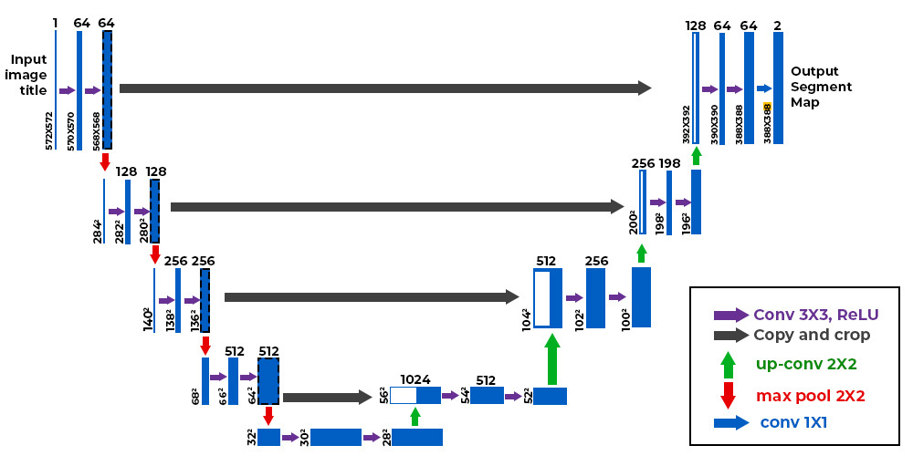

# 🏁 HCMUTE_Self_Driving_Car_2023 🏎
## Introduction
Self-Driving Car using Image Processing and Artificial Intelligence in 2023 by UTE organized

```bibtex
Team = {BYTEUS}
Mentor = {Nguyen Ngoc Nhan},
Members = {Dinh Van Tinh, Nguyen Minh Tien Dat, Vu Quoc Khanh}
year = {2023}
```

## To do task
- [x] Lane processing and recognition
- [x] Tuning PID for velocity
- [x] Tuning PID for angle
- [x] Detect and control car traffic signs and obstacles 


## Methods
### Lane Segmentation: UNET 


### Object Detection: YoloV8 


## Reward

